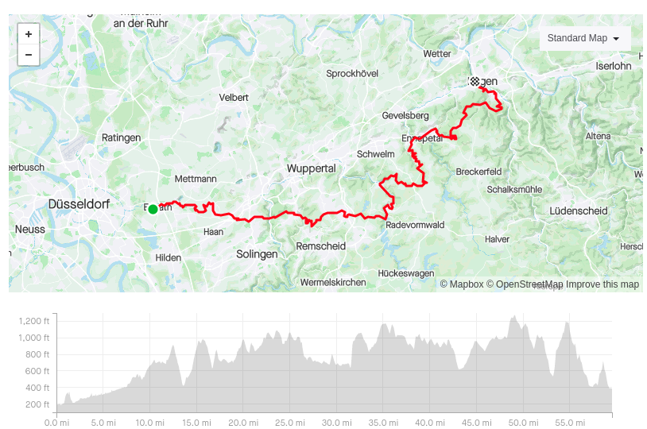

+++
title = "We just completed our 1st hike"
date = "2021-09-25"
image = "banner.webp"
+++

Our first edition just completed! 5 of us started in Erkrath. We were trying to reach Hagen but we stopped near Beyenburg at km 60.

Our plan was:

***When:***  
Departure: Saturday September 25th, approx. 7:15AM  
Arrival: Sunday September 26th, 7:01AM  

***Starting Point:***  
Park&Ride Erkrath S-Bahnhof ( you can take the S8 from Düsseldorf HBF at 7:00 latest )  
https://goo.gl/maps/83a2mRMBpvoRuri79  

***Finish Point:***  
Laterne Restaurant in Hagen (near the train station)  
https://goo.gl/maps/T6EXzLvVRL3isM5r6  

***Route:***  
Strava Route: https://www.strava.com/routes/2876028512535594646  
GPX file https://drive.google.com/file/d/1i1BFKsncHcGWNad5-xIr-lEq3pBjpcOI/view?usp=sharing  
Googlemaps route: https://www.google.com/maps/d/u/0/edit?mid=1iUwDZlx3uTfxIMY-BfPFV3T6QI3PfncI&usp=sharing

***Segments:***  
Segment 1 - Erkrath to Gruiten  
We follow the Neandertal route and stop at a grocery store to refill.  
Supernah Gruiten  
https://goo.gl/maps/nWSqy4eux12SotjV6

Segment 2 - Gruiten to Wuppertal  
Lunch! (counting 1h break)  
Café-Restaurant Haus-Zillertal  
https://g.page/HausZillertal?share

Segment 3 - Wuppertal to Remscheid  
Refill at REWE  
https://goo.gl/maps/hiYgJDFT8xPYE6ru7  

Segment 4 - Remscheid to Beyenburger Stausee  
Birks Imbiss / Birks Cafe  
https://goo.gl/maps/tS7o35r4aw7mF4U67

Segment 5 - Beyenburger to Ennepetal  
Last chance to refill on food and water!  
Aral 24/7  
https://goo.gl/maps/NNKuj2qFv3F8YvTD9

Segment 6 - Ennepetal to Selbecke  
Really not much here

Segment 7 - Selbecke to Hagen  
Laterne Restaurant

| Segment | Location      | Miles | Diff (miles) | km   | Diff (km) | Est. Time | Est. Clock  |
|---------|---------------|-------|--------------|------|-----------|-----------|-------------|
| 0       | Erkrath       | 0     | 0            | 0    | 0         | 0         | 7:15:00 AM  |
| 1       | Gruiten       | 8     | 8            | 12.9 | 12.9      | 2:40:00   | 9:55:00 AM  |
| 2       | Wuppertal     | 16    | 8            | 25.7 | 12.9      | 5:20:00   | 12:35:00 PM |
|         | 1h spare time |       |              |      |           |           |             |
| 3       | Remscheid     | 20.5  | 4.5          | 33.0 | 33.0      | 7:50:00   | 3:05:00 PM  |
| 4       | Beyenburger   | 29.2  | 8.7          | 47.0 | 14.0      | 10:44:00  | 5:59:00 PM  |
|         | 1h spare time |       |              |      |           |           |             |
| 5       | Ennepetal     | 41.6  | 12.4         | 66.9 | 19.9      | 15:52:00  | 11:07:00 PM |
| 6       | Selbecke      | 51.5  | 9.9          | 82.9 | 15.9      | 19:10:00  | 2:25:00 AM  |
|         | 1h spare time |       |              |      |           |           |             |
| 7       | Hagen         | 59.6  | 8.1          | 95.9 | 13        | 22:52:00  | 6:07:00 AM  |

It turns out this table was widely optimistic :D

